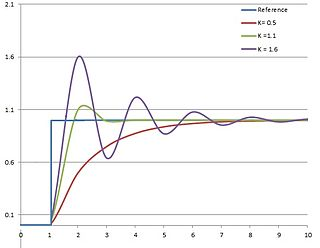

# PID
PID is a closed-loop control type very common in FRC, and is named based on its three parts:
**P**roportional, **I**ntegral, **D**erivative.

#### Proportional Control
Proportional control, or a P loop, consists of a single constant `kP`.
The loop applies an output _proportional_ to the error. Or in a formula:
`p = kP * e(t)`.

This graph shows different tunings of a P loop:



- For `k = 1.6`, the system oscillates and overshoots the setpoint/reference significantly.
 `k` is too high, and takes a long time to settle at the target.
- For `k = 0.5`, the system accelerates slowly, but doesn't oscillate or overshoot;
though it reaches the int/reference after a relatively long time. `k` is too low, causing slow acceleration.
- For `k = 1.1`, the system accelerates quickly, and although it oscillates and slightly overshoots the 
 setpoint/reference, it is tuned better than the previous two options.

#### Integral Control 
Integral control is useful for increasing the acceleration of the system. 
It also has a single constant `kI` that is multiplied by the integral of `e(t)` to produce the output.

#### Derivative Control
Derivative control is useful for smoothing acceleration and preventing overshoot. 
It consists of a constant `kD` that is multiplied by the derivative of `e(t)` to produce the output. 
Or in a formula: ```d = kD * e`(t)```

#### PID Control
A classic PID control loop sums the proportional, integral, and derivative parts to return an output.
However, in some uses not all three parts are useful and `PD`/`PI` or even `P` loops are used.

#### Feed-Forward
A problem with classic PID control is that it all depends on `e(t)` in some degree.
Therefore, a force like gravity can mess up a classic PID loop. 
That is where feed-forward is useful. 
Feed-Forward is added to the classic PID output, resulting in a PIDF loop.
There are two types of Feed-Forwards, and while it is uncommon, they can be combined: 

- ###### Arbitrary Feed-Forward
    A constant addition is added to the PID output.
    This is useful for mechanisms such as elevators that are constantly against gravity.
    
- ###### Relative Feed-Forward
    A varying addition to the PID output.
    One example is balancing an arm against gravity: 
    `f = kF * cos(angle)` where `angle` is the angle from the floor.

### Summary
A full formula for a PIDF loop: ```out = kP * e(t) + kI * Se(t) + kD * e`(t) + F + aff```

Usually few of these components will be zeroed and ignored.